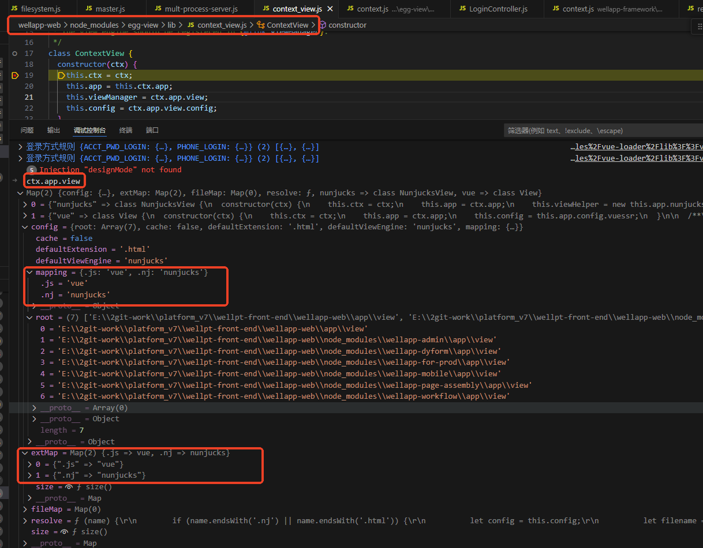

- 启动vuessr 
```javascript
// wellapp-framework\config\plugin.js
exports.vuessr = { enable: true, package: 'egg-view-vue-ssr' };
```

- 登录页渲染 `await ctx.render('login/index.js', {`调用下方代码
```javascript
// wellapp-web\node_modules\egg-view\app\extend\context.js
render(...args) {
    return this.renderView(...args).then(body => {
      this.body = body; // 返回浏览器的html?
    });
  },
 ```
- 重写 renderView
```javascript
//  wellapp-framework\app\extend\context.js
renderView(...args) {
    
    return this.view.render(...args);
}
```
- 实例化上下文视图（ContextView）
```javascript
// wellapp-web\node_modules\egg-view\app\extend\context.js
  get view() {
    if (!this[VIEW]) {
      this[VIEW] = new ContextView(this);
    }
    return this[VIEW];
  },
```
- "上下文视图"类

<!--  -->

```javascript
// wellapp-web\node_modules\egg-view\lib\context_view.js
class ContextView {
   this.viewManager = ctx.app.view;
}

/* 
    wellapp-web\node_modules\egg-view-vue-ssr\config\config.default.js
    config.view = {
        mapping: {
        '.js': 'vue',
        },
    };

    wellapp-framework\config\config.default.js
     // 定义视图解析引擎
    config.view = {
        root: viewDirs.join(','),
        defaultExtension: '.html', // 默认后缀
        defaultViewEngine: 'nunjucks', // 默认视图引擎: nunjucks
        mapping: {
        '.nj': 'nunjucks'
        }
    };

    wellapp-web\node_modules\egg-view\lib\view_manager.js 的constructor
    for (const ext of Object.keys(this.config.mapping)) {
      this.extMap.set(ext, this.config.mapping[ext]);
    }

    extMap 的值
    {'.js':'vue'}
    {'.nj':'nunjucks'}
    */
```

- 通过视图引擎渲染文件
```javascript
// wellapp-web\node_modules\egg-view\lib\context_view.js
/**
*通过视图引擎渲染文件
*@param｛String｝name-基于根的文件路径
*@param｛Object｝[locals]-模板使用的数据
*@param｛Object｝[options]-视图选项，您可以使用`options.viewEngine `指定视图引擎
*@param{…any}参数
*@return{Promise<String>}result-返回一个带有渲染结果的Promise
*/
 render(name, locals, options, ...args) {
    return this[RENDER](name, locals, options, ...args);
  }
```
- 获取当前视图实例
```javascript
// wellapp-web\node_modules\egg-view\lib\context_view.js
// ext -> viewEngineName -> viewEngine
async [RENDER](name, locals, options = {}) {
  
  viewEngineName = this.viewManager.extMap.get(ext); // viewEngineName是 vue

  const view = this[GET_VIEW_ENGINE](viewEngineName);
}
```

- 获取当前视图引擎类的引用，实例化后返回实例
```javascript
// wellapp-web\node_modules\egg-view\lib\context_view.js
[GET_VIEW_ENGINE](name) {
  const ViewEngine = this.viewManager.get(name);
  // ViewEngine指向的是wellapp-web\node_modules\egg-view-vue-ssr\lib\view.js中的  View 类 
  const engine = new ViewEngine(this.ctx); 
  if (engine.render) engine.render = this.app.toAsyncFunction(engine.render);
  return engine;
}
```

- 使用当前视图实例渲染
```javascript
// wellapp-web\node_modules\egg-view\lib\context_view.js
async [RENDER](name, locals, options = {}) {
  const view = this[GET_VIEW_ENGINE](viewEngineName);
   /* 
   view.render 指向的是 wellapp-framework\app\extend\context.js中的
   this.view.viewManager.get('vue').prototype.render = function (name, locals, options = {}) {
    */
  return await view.render(filename, this[SET_LOCALS](locals), options);
}
```

- 重写 egg-view-vue-ssr / lib / view.js , 实现项目定制化诉求
```javascript
// wellapp-framework\app\extend\context.js
this.view.viewManager.get('vue').prototype.render = function (name, locals, options = {}) {
    let renderPromises = [this.app.vue.render(name, context, options)];
    /* 
    this.app.vue.render 指向 wellapp-web\node_modules\egg-webpack-vue\app.js
    */

    // this.app.vue.renderClient 指向的wellapp-web\node_modules\egg-view-vue-ssr\lib\engine.js
}
```

- egg-webpack-vue中的render
```javascript
// wellapp-web\node_modules\egg-webpack-vue\app.js
app.vue.render = (name, context, options) => {
    const promise = app.webpack.fileSystem.readWebpackMemoryFile(filePath, name);
  };

```
- 读取webpack内存文件
```javascript
// wellapp-web\node_modules\egg-webpack\lib\filesystem.js
  readWebpackMemoryFile(filePath, fileName, target = 'node') {
    return new Promise(resolve => {
        // master.js中 worker.on('message', msg => { 回调会触发
      this.app.messenger.sendToAgent(Constant.EVENT_WEBPACK_READ_FILE_MEMORY, {
        filePath,
        fileName,
        target
      });
      this.app.messenger.once(Constant.EVENT_WEBPACK_READ_FILE_MEMORY_CONTENT, data => {
        if (filePath === data.filePath) {
          resolve(data.fileContent);
        }
      });
    });
  }
```

